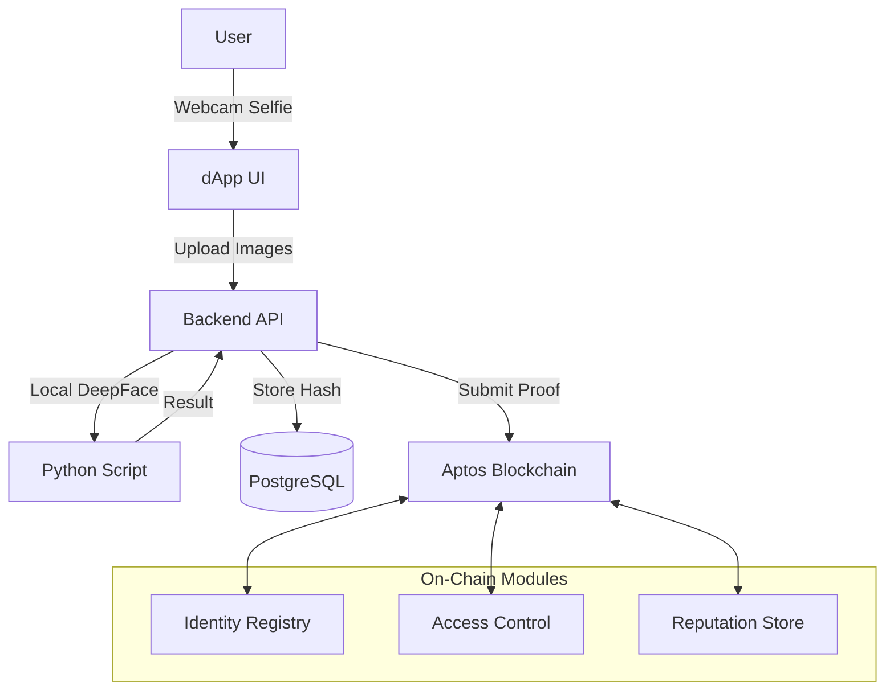

# @cognifyr/aptos-kyc-sdk


> **The Trust Layer for the World's Fastest Blockchain.**

The official TypeScript SDK for the Aptos KYC & Identity infrastructure. This SDK enables dApps to integrate user verification, compliance checks, and on-chain reputation seamlessly, ensuring that speed never compromises security.

---

## ⚡ Why Super Fast Aptos Needs Trust Too

Aptos is engineered for unparalleled speed and scalability, processing thousands of transactions per second with sub-second latency. It is the Formula 1 of blockchains.

**But speed without control is dangerous.**

As the Aptos ecosystem expands into **DeFi**, **Real World Assets (RWA)**, and **Institutional Finance**, the need for reliable, compliant, and privacy-preserving identity verification becomes critical. You cannot build a mortgage platform, a compliant exchange, or a reputation-based DAO without knowing *who* is behind the address.

**This SDK bridges the gap.** It ensures that while your transactions move at the speed of light, they remain anchored in trust.

---

## 🏗️ Architecture



---

## 📦 Installation

You can install the SDK directly from the packed tarball:

```bash
npm install ./cognifyr-aptos-kyc-sdk-1.0.0.tgz
```

Or if published to a registry:

```bash
npm install @cognifyr/aptos-kyc-sdk
```

---

## 🔗 Deployed Contracts (Aptos Testnet)

The core infrastructure is deployed and live on the Aptos Testnet.

| Contract | Address |
|----------|---------|
| **Module Address** | `0x938bd5a2fabaac81a6bbbbcb5b0611691d2b217c5c446f5ed45d4111f07c06e` |
| **Identity Registry** | `...::IdentityRegistry` |
| **Access Control** | `...::AccessControl` |
| **Compliance** | `...::ComplianceEngine` |
| **Fraud Guard** | `...::FraudGuard` |
| **Reputation** | `...::ReputationStore` |

[View on Aptos Explorer ↗](https://explorer.aptoslabs.com/account/0x938bd5a2fabaac81a6bbbbcb5b0611691d2b217c5c446f5ed45d4111f07c06e/modules?network=testnet)

---

---

## 🚀 Quick Start

Initialize the client with your backend URL and Aptos node connection.

```typescript
import { createKycClient } from '@cognifyr/aptos-kyc-sdk';

const client = createKycClient({
  apiBaseUrl: 'http://localhost:3001/api/v1', // Your backend URL
  aptosNodeUrl: 'https://fullnode.testnet.aptoslabs.com/v1',
  moduleAddress: '0x...' // Address where contracts are deployed
});
```

---

## 🛠️ Core Features

### 1. Identity Verification (KYC)

Perform a full KYC flow including email, phone, and **Local DeepFace** biometric verification.

```typescript
// 1. Start Session
const { sessionId } = await client.startSession(userWalletAddress);

// 2. Verify Contact Info
await client.verifyEmail(sessionId, 'user@example.com');
await client.verifyPhone(sessionId, '+1234567890');

// 3. Verify Identity (Webcam Selfie + ID)
// The SDK handles image upload to the backend for local DeepFace processing
await client.verifyFace(sessionId, idFile, selfieFile);

// 4. Complete & Mint Identity
const result = await client.completeKyc(sessionId);
console.log(`Identity minted! Tx: ${result.txHash}`);
```

### 2. 🛡️ Access Control Module

Gate access to your dApp based on user identity status.

```typescript
// Check if user has valid KYC
const hasAccess = await client.accessControl.checkAccess(userAddress);

if (hasAccess) {
  // Allow transaction
} else {
  // Redirect to KYC flow
}
```

### 3. ⭐ Reputation Module

Fetch on-chain trust scores and badges.

```typescript
const reputation = await client.reputation.getScore(userAddress);

console.log(`Trust Score: ${reputation.score}`);
console.log(`Badges: ${reputation.badges.join(', ')}`);
```

### 4. ⚖️ Compliance Module

Run automated regulatory checks (AML, sanctions, age).

```typescript
const compliance = await client.compliance.checkCompliance(userAddress, [
  'US_RESTRICTED', 
  'MIN_AGE_18'
]);

if (!compliance.allowed) {
  console.error(`Blocked: ${compliance.reason}`);
}
```

### 5. 🚨 FraudGuard Module

Check for suspicious activity or blacklisted wallets.

```typescript
const riskProfile = await client.fraud.checkRisk(userAddress);

if (riskProfile.isBlacklisted) {
  throw new Error("Wallet is flagged for fraud");
}

console.log(`Risk Score: ${riskProfile.score}/100`);
```

### 6. 🪪 Credentials (DID)

Issue and verify W3C-compatible Verifiable Credentials.

```typescript
const credentials = await client.did.getCredentials(userAddress);

credentials.forEach(cred => {
  console.log(`Credential Type: ${cred.type}`);
  console.log(`Issuer: ${cred.issuer}`);
});
```

---

## 🔧 Configuration Options

| Option | Type | Default | Description |
|--------|------|---------|-------------|
| `apiBaseUrl` | `string` | **Required** | URL of your running backend API |
| `aptosNodeUrl` | `string` | `https://fullnode.testnet...` | Aptos RPC URL |
| `moduleAddress` | `string` | `0x1` | Address of deployed Move contracts |
| `timeout` | `number` | `10000` | Request timeout in ms |

---

## 🏗️ Building from Source

If you want to modify the SDK:

```bash
# Install dependencies
npm install

# Build to dist/ (ESM + CJS)
npm run build

# Create tarball
npm pack
```

---

## 📄 License

MIT
